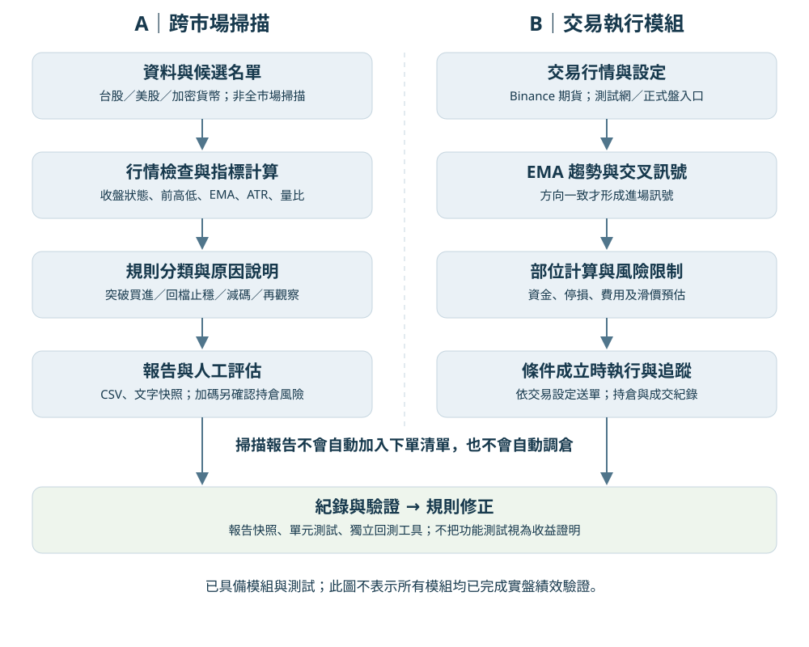

# 自動交易研究：跨市場訊號分析與規則驗證

本專案展示如何把市場觀察轉為明確規則，並用報告與測試檢查判斷過程。核心問題是：**熱門標的是否同時具備進場條件？系統如何解釋「買進候選」與「再觀察」的差異？**

這是自動交易研究專案的公開展示版，包含行情掃描、規則分類、報告、獨立策略比較與測試；完整研究另有交易執行與風險管理模組，未包含於本展示版。這裡的程式不下單，也不需要交易帳戶金鑰。

## 先看成果

- [2026-10-06 交易檢討與策略比較](docs/strategy_review_20261006.md)：從近期測試網紀錄出發，比較 EMA 基準、ADX 過濾及 ATR 出場；公開包含未通過驗證的結果。
- [研究程式與重現方法](research/README.md)：一年公開行情快照、含成本比較及測試。
- [專案紀錄：完整文字](docs/project_record.md)：從交易規則、成交對帳與風控，到市場報告和後續驗證的改進歷程。
- [專案紀錄 PDF](docs/project_record.pdf)：整理上述研究歷程，可下載閱讀。
- [系統流程圖](docs/system_flow.svg)：市場掃描與交易執行的分工。
- [離線範例輸出](examples/demo_report.md)：使用明確標示的合成資料，展示不同規則結果。
- [規則說明](tools/HOT_MARKET_RULES.md)：突破買進、回檔止穩、加碼候選的條件與限制。



## 這個專案是怎麼逐步改進的

研究從 EMA 趨勢與交叉訊號延伸到交易執行中的細節：同一訊號如何避免重複開倉、觸發平倉價格和實際成交價格如何區分，以及費用和資金費如何記錄。2026 年 9 月 24 日的改進紀錄，進一步補上延遲成交對帳及每日剩餘風險額度的處理。

使用 Hot Market 時，我提出「為什麼大多數標的都是再觀察，而且沒有加碼選項」的問題。檢查 9 月 30 日的報告與規則後，發現既有行情未達門檻的因素，也有回檔止穩和加碼情境尚未實作的缺口，因此保留突破條件，補上不同情境的判斷。

[專案紀錄](docs/project_record.md)收錄 2026 年 6 月 25 日、8 月 9 日的報告狀態，以及後續問題、修改方法與目前限制。交易執行、帳務和回測屬於完整本機研究，本儲存庫公開的是市場掃描部分；測試通過不代表收益已改善。

## 不連網也能重現

Python 3.10 以上。在此儲存庫根目錄執行：

```bash
python demo.py
```

僅使用 Python 標準函式庫，不下載行情、不讀取帳戶，也不下單。它會重建 `examples/demo_report.md`，展示突破、回檔、過熱、減碼與資料未確認等情境。

## 驗證與實際掃描

```bash
python -m pip install -r requirements.txt
python -m unittest discover -s tests -v
```

測試使用合成行情及 mock，不需連線到行情服務。涵蓋進場判斷、過期／缺漏資料、前高低排除當根日 K、報告保存及候選名單篩選。

如要自行取得公開行情：

```bash
python tools/hot_market_scanner.py --universe watchlist --top 3
```

此命令會連網並將結果寫入 `reports/hot_markets/`。隨附名單只是三個公開標的的操作範例，不是投資推薦。使用 `--universe hybrid` 可加入台美股動態榜單候選；候選範圍並非全市場，資料服務可能限流或中斷。

## 如何閱讀程式

| 檔案 | 責任 |
|---|---|
| `tools/hot_market_scanner.py` | 行情取得、指標計算、報告輸出 |
| `tools/market_advice.py` | 規則分類、持倉情境文字、歷次比較 |
| `tools/market_universe.py` | 候選來源、篩選與去重 |
| `tests/` | 指定行為與異常情境驗證 |
| `demo.py` | 不需帳戶與網路的最小展示 |
| `research/` | 公開行情下載、ADX／ATR 候選策略、含成本比較與研究結果 |

## 目前限制與下一步

- 規則門檻尚未以樣本外績效驗證；功能測試不代表策略有效。
- 加碼提示未讀取持倉，不能確認實際風險或決定加碼數量。
- 原始價格與候選名單可能受資料供應商、公司行動及選樣方式影響。
- 下一步以相同資料期間比較新舊規則，納入成本、最大回撤與樣本外驗證。

## 個人工作與 AI 協作

本人提出自動交易研究需求，以及對「大量再觀察、缺少加碼提示」的疑問；本專案使用 AI 輔助程式檢查、修改、文件與測試。這份展示版不宣稱所有程式均由本人獨立撰寫。

前次專案紀錄的 38／20 項測試分別對應完整本機專案與當時的公開展示範圍。2026-10-06 新增 8 項策略研究測試後，完整本機專案共 46 項，公開展示版共 28 項；兩者皆已通過。
